# **Analysing South African Property Markets: A Data-Driven Approach to Identifying Areas Positioned for Property Value Growth**

Property investment is widely recognized as a crucial component of a successful investment portfolio. While numerous factors influence the outcomes of property investments, the adage "location, location, location" remains a paramount consideration. Consequently, this study aims to establish an efficient and effective framework using a data-driven approach for analysing property markets. The primary objective is to identify locations with the potential for substantial returns on investment.

By leveraging data-driven techniques, we can delve deeper into the complexities of property markets and uncover valuable insights. This approach allows us to move beyond mere intuition and subjective assessments, enabling a more objective evaluation of various market indicators. Through this study, we aim to equip investors and stakeholders in the property industry with a robust methodology to identify promising locations and make informed investment decisions.

## **Project Design**

The project goal was to leverage publicly available data and established an analytical framework in order to identify local property markets with the greatest growth potential. To accomplish this purpose, a pragmatically designed analytical process was developed which enabled the derivation of actionable insights to be concluded.

The selection of evaluation metrics was driven by the consideration of which features were essential for the assessment of market quality. Furthermore, the availability of publicly accessible data was a factor in the decision-making as it determined the feasibility of conducting the analysis. The list of chosen indicators follows:

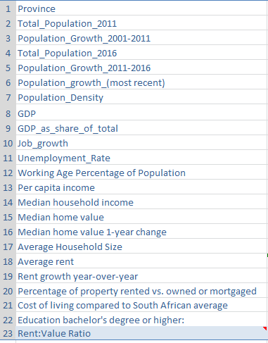

## **Project components**

The market analysis process followed a hierarchical approach based on national political boundaries. It commenced with the design of a municipality filter, followed by an in-depth municipal analysis. Subsequently, the focus narrowed down to identifying the most favourable suburbs within those districts. The detailed process for each stage can be found in the successive sections of this report. 

## **Data Requirements and Limitations**

Due to the scope of the analysis a large variety of data was required. Census data from StatsSA was the primary data source for the initial location filtering and subsequent municipal analysis. Additional data including but not limited to crime and education statistics was required in order to conduct the suburb analysis.

The data collection process encountered numerous challenges, which have consequently impacted the quality and accuracy of the study's results at this stage. It is important to acknowledge that the findings currently do not provide a reliable representation due to these limitations.

During the development of this project, one of the significant data limitations was the lack of proficient skills in efficient data collection. As a result, alternative strategies and methods were employed to overcome this challenge. Further details regarding these strategies can be found in the various data collection sections. Despite the reliance on untrustworthy data, the decision to pursue the project was motivated by the objective of establishing a framework for future iterations and improvements. It was recognized that as the skillset expanded, subsequent analyses would benefit from enhanced data collection practices.

Another significant data limitation stemmed from the out-dated nature of the StatsSA Census data which rendered it unsuitable as a reliable source for making informed decisions. An updated dataset is due to be released in 2023 and once this becomes available the project will be revisited and updated accordingly.

## **Phase 1 | Municipal Analysis**

### **Municipal Data Collection**

Prior to commencing data collection, a strategic decision was made to narrow down the scope of analysis by limiting the number of municipalities that would qualify for analysis. This approach aimed to streamline the data collection process by focusing on a more manageable dataset. The initial criteria for municipality selection entailed considering municipalities with top-ranking population growth rates, coupled with a minimum population threshold of 75,000 residents. Applying this filtering criterion resulted in the identification of 27 municipalities that proceeded to the subsequent stages of analysis. 

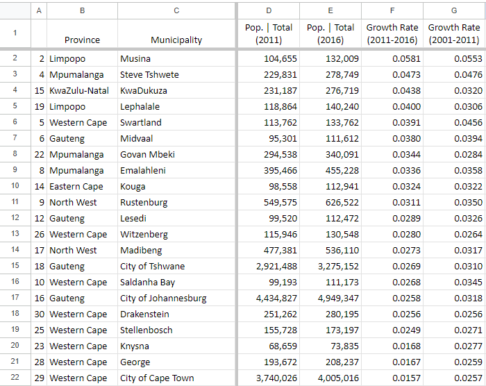
 
At the outset of the project, it was acknowledged that skills in data collection and sourcing were insufficient. However, a deliberate decision was made to adopt an alternative strategy, allowing for the initial development of the project while being fully aware of the limitations of the gathered data. Consequently, no investment decisions could be based on the analysis, given the unreliability and lack of trustworthiness of the data.

Considering the recent surge in interest surrounding artificial intelligence (AI) and the accessibility of tools like Chat-GPT to the public, it was determined to leverage the platform for populating the required database. To streamline the data collection process, a standardized prompt was designed, simplifying the procedure of requesting and capturing data in an Excel format. This approach was executed for all 27 municipalities.

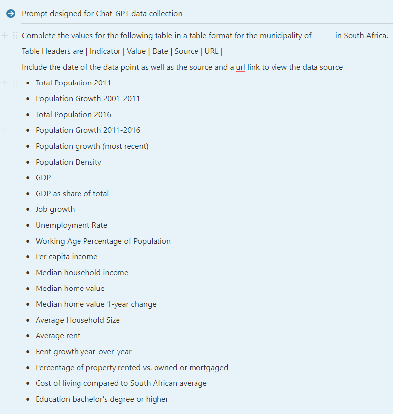
 
### **Municipal Data Processing**

The data obtained from Chat-GPT was collected and collated in an Excel table allowing for the utilisation of structured references in formulas. Prior to proceeding with analysis that data required cleaning and formatting. Depending on the data point all or some of the following steps were undertaken:
1.	String conversion to Integer or Float: Where necessary, string data was converted to numerical formats. This ensured that quantitative analysis could be performed.  
2.	Character search and string slicing: In order to remove unwanted characters from the data, character and string slicing techniques were employed.
3.	Conditional statements: These allowed for the implementation of specific rules or conditions that tolerated variations in the data and therefore ensured consistence and accuracy in the analysis. 

Additionally, some minor feature engineering was conducted to enhance the dataset. One example of this was the creation of a Rent:Value ratio by dividing the average rent by the median home value. This new feature provided additional insights and metrics that could further contribute to the analysis of the property market data. 

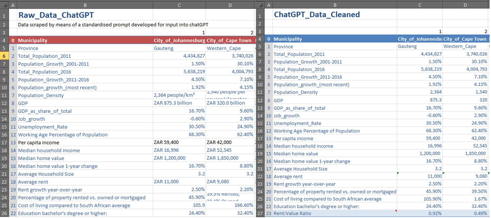
  
### **Municipal Data Analysis**
To evaluate the quality of each municipality, a relative ranking system was implemented. This system involved assigning a ranking to each metric in the dataset based on its position relative to all other locations. The `RANK.AVG()` function was utilised for this purpose. The order parameter was set to 0 for metrics where a higher value was favourable and set to 1 in the event that a lower value was desired.

By employing this approach, a cumulative total could be computed at the conclusion of the ranking process. The resulting total represented the final municipal ranking in terms of desirability from most to least favourable. The specific ranking provides valuable insights into the relative desirability of each municipality as an investment destination.

## **Phase 2 - Suburb Analysis**

Upon concluding the municipal analysis, the next step was to start zooming in on specific location so attention shifted towards the suburb analysis. During this phase, three key metrics were identified as crucial indicators of property demand and potential market growth. These metrics are as follows:

1. Education district quality: The quality of education districts plays a significant role in attracting property demand. Assessing the education standards within a suburb provides valuable insights into its overall desirability as a residential area.
2. Crime rates: Understanding the crime rates within a suburb is essential for evaluating its safety and liveability. Lower crime rates generally contribute to increased property demand and a positive investment outlook.
3. Neighbourhood walkability: Walkability refers to the ease and convenience of accessing amenities, services, and transportation options within a neighbourhood. Suburbs with higher walkability scores tend to be more desirable for potential property buyers, thereby indicating potential market growth.

### **Education Data Collection**

The collection of education data posed a significant challenge due to the lack of uniformity between educational districts and governmental municipal boundaries. The StatsSA census data did not offer detailed education data at the suburban level, and the South African Department of Education does not provide a publicly accessible dataset suitable for comprehensive analysis. After thorough consideration, a research project conducted by students of Stellenbosch University emerged as the most valuable dataset for conducting effective analysis and reaching conclusions regarding school district quality. URL: https://cga-sun.maps.arcgis.com/apps/MapSeries/index.html?appid=4c4bc6484d354496a5208b44c038b64c
 
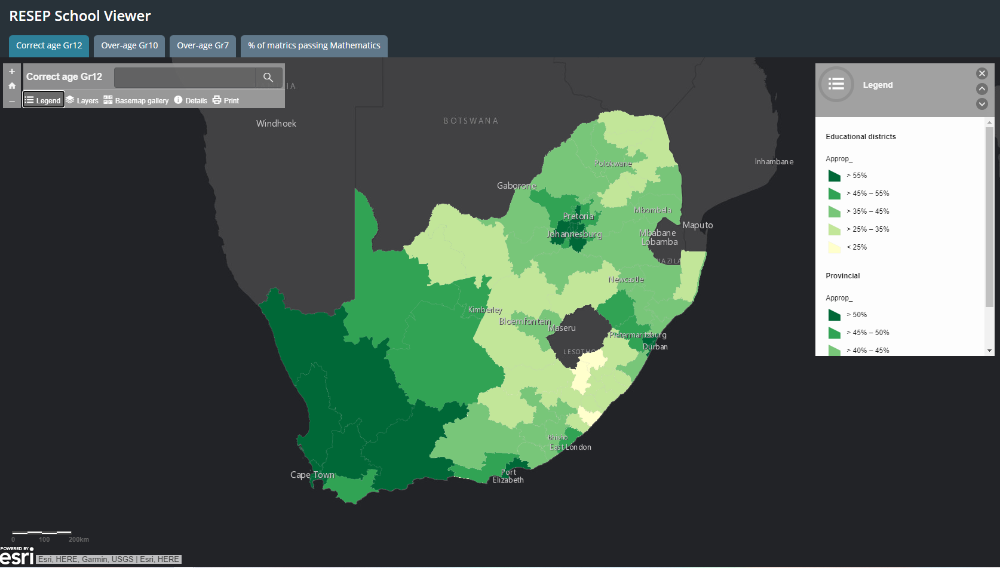

The nature of the data required a manual entry process to capture it accurately. As a result, the list of municipalities eligible for further analysis was intentionally limited to Gauteng and Western Cape provinces. This decision was made to ensure a feasible workload for the manual data entry and to facilitate the development of the analytical framework. Although this concession restricted the scope of analysis, it paved the way for future iterations aimed at expanding the dataset. Given the manual data entry process, the captured data did not require additional cleaning or formatting. 

### **Education Data Methodology**

The research project utilized data that presented statistics on the percentage of learners of the correct age at different stages of the education system. The dataset included columns such as `correct_age_gr12`, `correct_age_gr10`, `correct_age_gr7`, and `%_matrics_passing_maths`.

Regarding the age variables, the "correct age" percentage represented the proportion of learners progressing at the expected rate for their age group. This metric served as an indicator of the quality of education within the district, implying that a higher percentage of correct age learners suggested a better quality of education. Conversely, districts with lower percentages of correct age learners were considered to have lower educational quality.

Similarly, the percentage of matric students passing mathematics was accepted as another measure of education district quality. Higher percentages of students passing math indicated a higher quality of education within the district. 
 
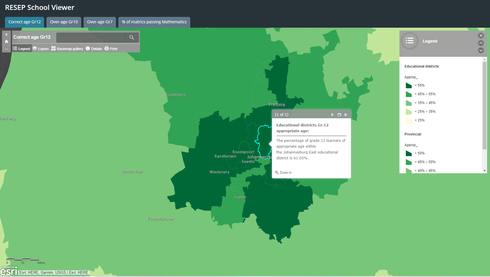

### **Education Data Analysis**

To evaluate the quality of school districts, a relative ranking system was employed, enabling a comprehensive comparison among the districts. This ranking process was performed for each variable, and subsequently, an overall ranking was calculated by aggregating the scores across all variables for each district.

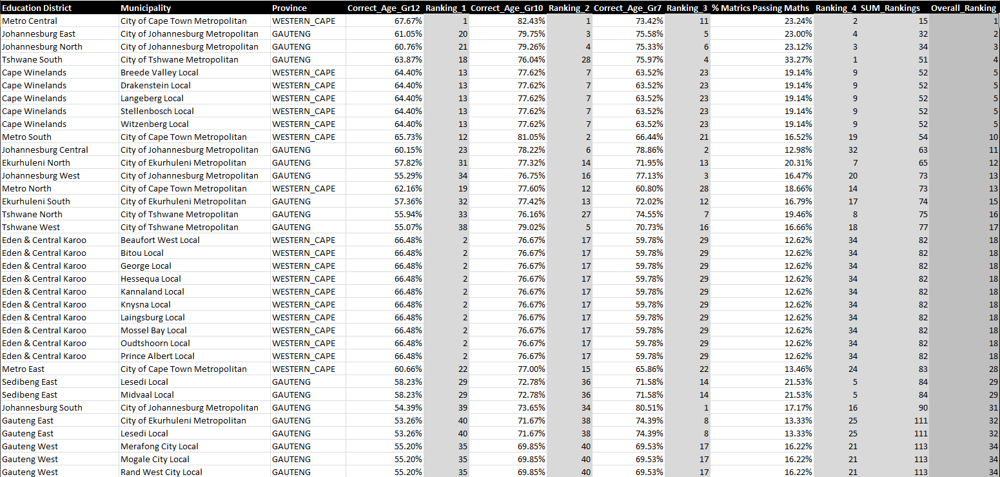
 
The ranking calculation involved utilizing the `RANK.EQ()` function to determine the relative position of each district within the dataset. The `INDEX()` function was then employed to cross-reference the relevant data with the corresponding locations in the corresponding municipality table.

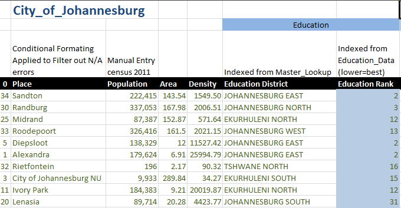  

By applying this ranking system, an assessment of the educational quality across different school districts could be achieved. The resulting rankings provided insight into the relative performance and desirability of each district in terms of education.

### **Crime Data Collection**

The South African Police Service (SAPS) regularly releases comprehensive crime statistics reports, including a quarterly Crime Statistics Presentation and an Annual Crime Statistics Presentation. For this analysis, the dataset utilized was the most recent edition of the Annual Crime Statistics publication, which covers the financial year 2021/2022. The dataset can be accessed at the following URL: https://www.saps.gov.za/services/crimestats.php. 

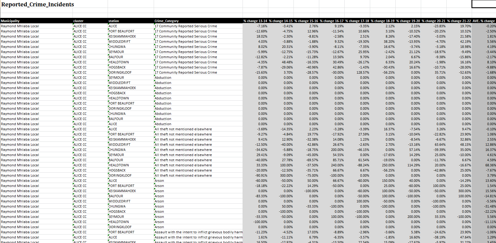
 
### **Crime Data Methodology**

The analysis of crime data encountered challenges due to the discrepancies between South African police station clusters and the boundaries associated with municipalities, suburbs, and education districts. These differences made it difficult to precisely match crime data with the pre-defined locations.

It was observed that police stations were often named after the suburbs in which they were situated, and their boundaries frequently overlapped with municipal classification boundaries. This presented an opportunity to match crime data to existing suburbs in the data table, enabling data integration. However, it should be noted that only approximately 38.5% of the suburbs within each municipality analysed could be successfully matched with police station data.

Although this approach may not be perfect, given the absence of a more suitable technique for merging the data, it was deemed the most feasible solution at the time. Despite the challenges posed by the inconsistent boundaries, the methodology aimed to incorporate crime data as effectively as possible to provide valuable insights into the crime rates within the analysed locations.

### **Crime Data Analysis**

The analysis of crime data involved working with a dataset that included the total number of reported incidents for each police station and the corresponding crime categories. Within the dataset, there were two main groupings of crimes: 17 Community Reported Serious Crimes and TRIO crimes.

The 17 Community Reported Serious Crimes grouping encompassed various crime categories, including Contact Crimes, Contact Related Crimes, Property Related Crimes, and Other Serious Crimes. This grouping provided a comprehensive overview of crime incidents within the community.

Additionally, the dataset included a separate grouping called TRIO crimes, which consisted of hijacking, house robberies, and business robberies. Since these crimes were directly related to property, they were given specific consideration to provide weighted data analysis for property-related crimes, aligning with the focus of the property analysis.

The analysis process followed the following steps:
1. Calculation of the average percentage change in reported incidents for each aggregated category of crimes at each police station, considering the available data spanning from 2013 to 2022. This involved combining the averages of the 17 community reported crimes and the TRIO crimes to obtain a final combined average percentage change (AVE. % Change).
2. Standardization of the total number of incidents for each police station by dividing it by the population of the respective location. This allowed for the calculation of a standardized per capita metric, facilitating fair comparison across different locations.
3. Ranking the results to categorize locations from best to worst in terms of crime rate. This ranking process enabled the classification of locations based on their relative crime rates, providing insights into the safety and security levels of each area.

By conducting this comprehensive crime data analysis, the project aimed to shed light on the crime rates and trends within the analysed locations, contributing to the overall assessment of the property investment potential in each area. 

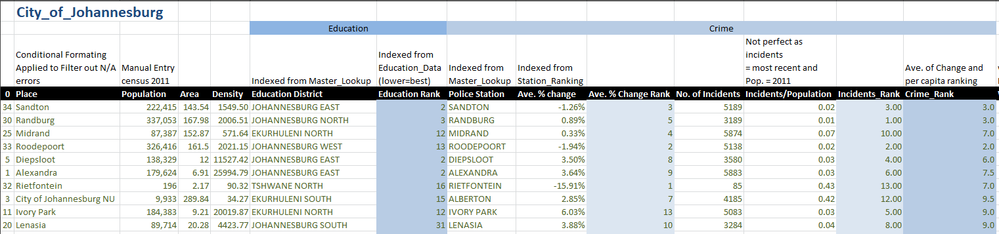
 
### **Walkability Data Collection**

To gather walkability data for various suburbs, the website walkscore.com was utilized. The process involved manually researching and inputting the data into the project's data table. Unlike other datasets, this data did not require further analysis or processing since walkscore.com had already conducted the necessary analysis and provided a final score for each location.
Higher scores on walkscore.com indicated greater walkability, implying that these areas were more pedestrian-friendly and offered easy access to amenities and services. Conversely, lower scores indicated relatively less walk-able suburbs.

By incorporating walkability data into the analysis, the project aimed to identify suburbs that offer a high level of walkability, which is often considered a desirable feature for potential property investors and residents.

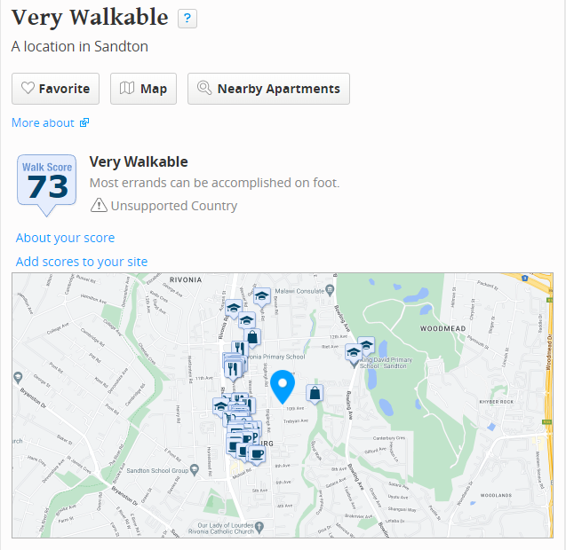
 
### **Final Location Rankings Based on Analysis**
After conducting comprehensive analysis and considering various metrics and criteria, the project resulted in the final ranking of suburbs within the selected municipalities. These rankings represent the culmination of the study, indicating the most favourable suburbs for property investment.

The rankings were derived from a careful evaluation of all of the key factors listed above from demographic metrics, education district quality, crime rates, and walkability. By combining these factors, the project identified the suburbs that exhibited the highest potential for property value growth and investment returns.

To enhance the presentation and accessibility of the findings, a user-friendly dashboard was developed. This dashboard provides a visual representation of the rankings, allowing stakeholders to easily interpret and explore the results. 

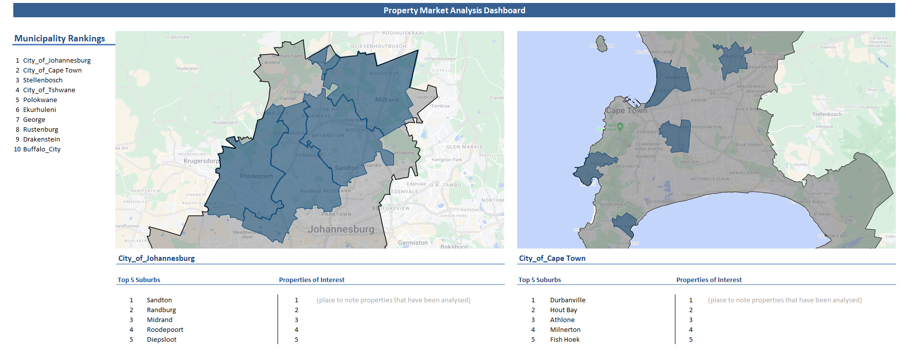
 
### **Next Steps**
While the current analysis has provided valuable insights, there are several aspects that require further attention in order to enhance the accuracy and utility of the framework.

First and foremost, addressing the issue of untrusted data is critical. Acquiring reliable and up-to-date data sources is essential to ensuring the validity of the analysis. Exploring alternative data collection methods and collaborating with reputable organisations or agencies could help to overcome this challenge.

To assess the accuracy of the analysis, additional data sources should be considered. Incorporating location-based property inflation data would enable a backward-facing study, comparing historical data with property inflation rates at different time points. This validation process would help evaluate the effectiveness of the ranking system and further refine the developed framework. Additionally, the implementation of a machine learning model could enhance the predictive capabilities of the framework, allowing for the identification of potentially lucrative property markets in the future.

While identifying favourable suburbs for property investment is an important aspect, it is equally important to conduct individual property analysis within those desirable locations. Developing an analysis framework specifically tailored to assess the feasibility and potential of individual properties would be the next logical step. This framework would enable investors to evaluate specific properties based on factors such as market trends, property condition, rental income potential, and other relevant considerations.
